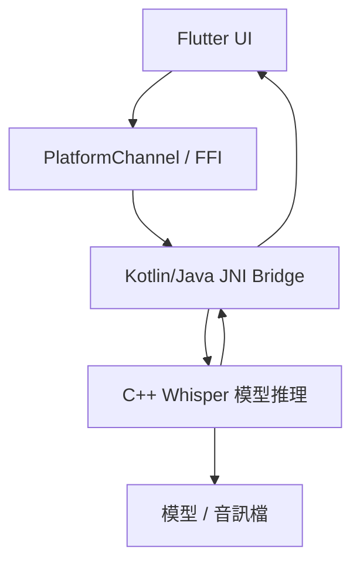

# Whisper Voice Notes

> 📱 本地語音筆記 App，支援 Whisper 離線語音辨識  
> ✨ Capture ideas instantly. Offline. Private. Whisper-powered.

---

## 🔍 專案簡介

本專案是一款 Flutter 架構的語音筆記 App，目標是在 Android 裝置上實現：

- 用戶快速錄下語音想法
- 自動辨識為文字（不需網路連線）
- 將筆記顯示或儲存

系統採用 OpenAI Whisper 模型的 C++ 實作版本 [`whisper.cpp`](https://github.com/ggerganov/whisper.cpp)，並透過 JNI 或 dart:ffi 方式與 Flutter 前端互動，實現 **完全本地語音轉文字功能**。

---

## 🧠 模型資訊

目前使用的模型為：

- 📦 模型名稱：`ggml-base-q5_1.bin`
- 放置路徑：`android/app/src/main/assets/ggml-base-q5_1.bin`
- 來源：由 whisper.cpp 官方下載，已驗證可運作於 M2 Mac

> 如需 VAD 自動斷句功能，後續可加入 `ggml-vad.onnx`

---

## 📦 架構設計概要



✅ 完成項目
本地測試 whisper.cpp 成功執行

模型已下載（base-q5_1）並確認辨識準確

專案已用 Android Studio 建立（Flutter + Kotlin）

GitHub repo 已建立、與本地同步

🚧 下一階段交接給 Cursor 任務（建議順序）
📁 1. 整合 Whisper 原始碼與模型
將 whisper.cpp 所需的 .cpp, .h 及 ggml 檔案加入到 android/app/src/main/cpp/

建立 CMakeLists.txt 以支援模型編譯與 .so 輸出

將 ggml-base-q5_1.bin 放進 assets/，並在 native 初始化時複製到可寫入路徑

🔧 2. 建立 JNI Native 接口
撰寫 JNI bridge，例如 native_interface.cpp，提供函式如：

cpp
複製
編輯
std::string transcribeWavFile(const std::string& filePath);
Kotlin 端建構 WhisperBridge.kt 呼叫 native 函式

🔄 3. Flutter 與 Native 溝通橋接
使用 MethodChannel 呼叫上述 native function

傳入 .wav 檔案路徑，接收辨識結果（String）

🎙️ 4. Flutter 錄音介面
建立簡單介面供使用者錄音

使用插件如 flutter_sound 或 audio_recorder2

儲存為 16kHz mono PCM wav，提供給 native 使用

🧪 5. 整合測試
錄音 → 辨識 → 顯示文字 → 儲存筆記（可先保存在本地）

記錄模型加載與辨識時間

📌 額外說明
初期僅支援 Android，iOS 可日後延伸

初版可不含 VAD，自動段落後續再加

App UI 僅需單頁：錄音按鈕 + 轉文字顯示區

📁 目錄預期結構（簡化）
bash
複製
編輯
whisper_voice_notes/
├── android/
│   ├── app/
│   │   ├── src/main/cpp/          # whisper.cpp 與 glue code
│   │   ├── src/main/assets/       # 模型檔 ggml-base-q5_1.bin
│   │   └── java/...               # WhisperBridge.kt
├── lib/
│   └── main.dart                  # 錄音 + 顯示介面
├── README.md
本 README 撰寫於初始階段，未來將依進度補充建置方式與 API 說明。

yaml
複製
編輯

---

你可以現在就複製這整段貼到專案根目錄下的 `README.md`，然後：

```bash
git add README.md
git commit -m "Add initial project README with architecture and plan"
git push
這樣 Cursor 或任何協作者看到這份 repo 就能立刻明白你的開發意圖與目標。